# Contribute to the M82 bibliography

## About

This tutorial details how to contribute to the M82 bibliography.

<https://github.com/BartM82/Bibliography>

The only prerequisite is to have a Github account.

## How to participate

To participate in the bibliography:

1. Click on the bibliography link.
2. If you have never contributed before, click on *fork*.

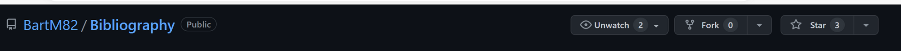

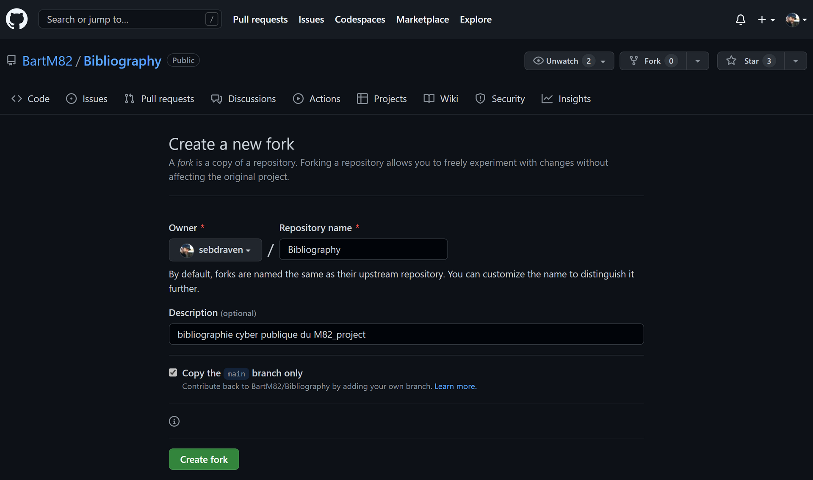
4. If you have already contributed, click on *Sync Fork* in your own directory.

5. Click on *Create for*.
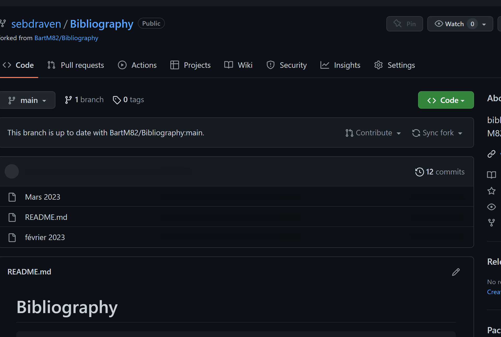

You can add, modify, or delete files.

To edit content :

1. Click on a file (here March 2023).
2. Click on *edit file*.

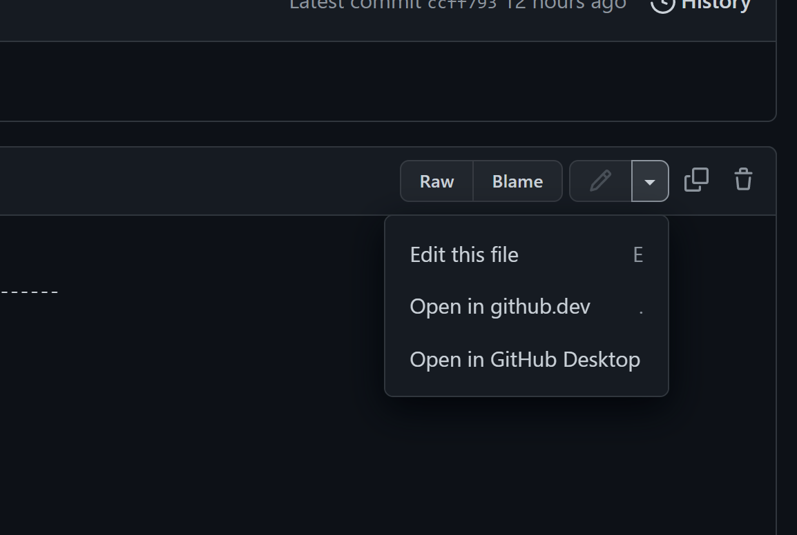

Here we change the file name to normalize.
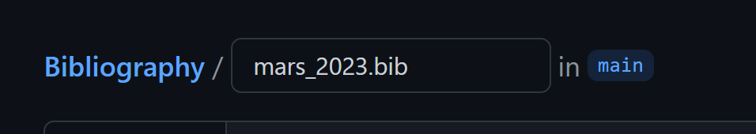

Once the modification is done, at the bottom of the page,
you must click on *Commit changes*. You can add a comment.

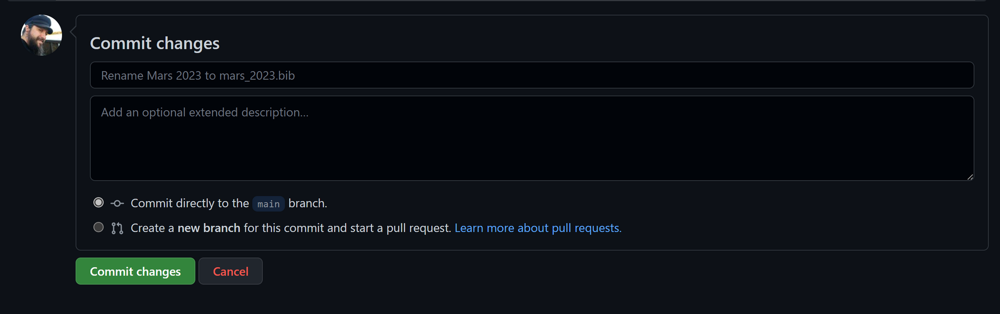

Once the changes are committed,

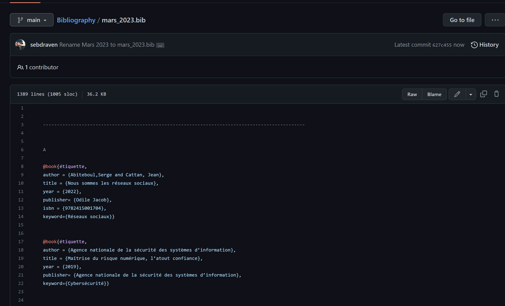

you can now request that your changes be applied by clicking on *Contribute*.

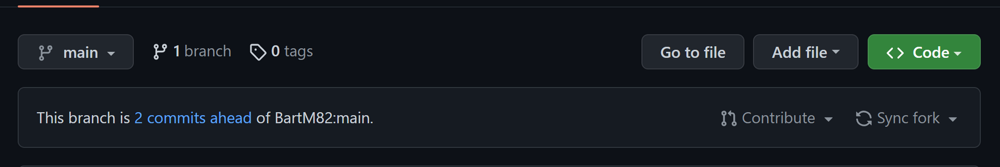

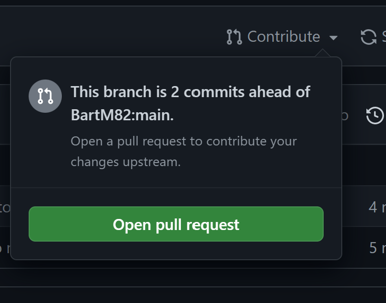

Click on *Open pull request*.

If there are no conflicts, the label *able to merge message* is present.

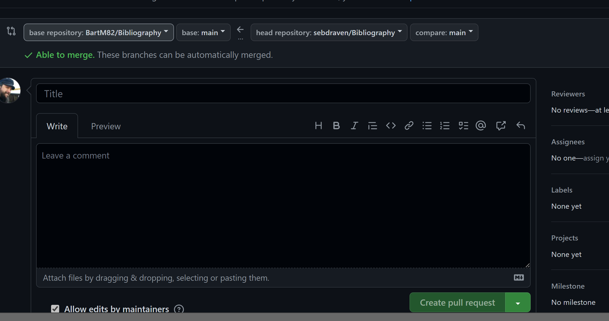

* Add a title.
* You can add comments to clarify all your changes.

And click on *Create Pull Request*.

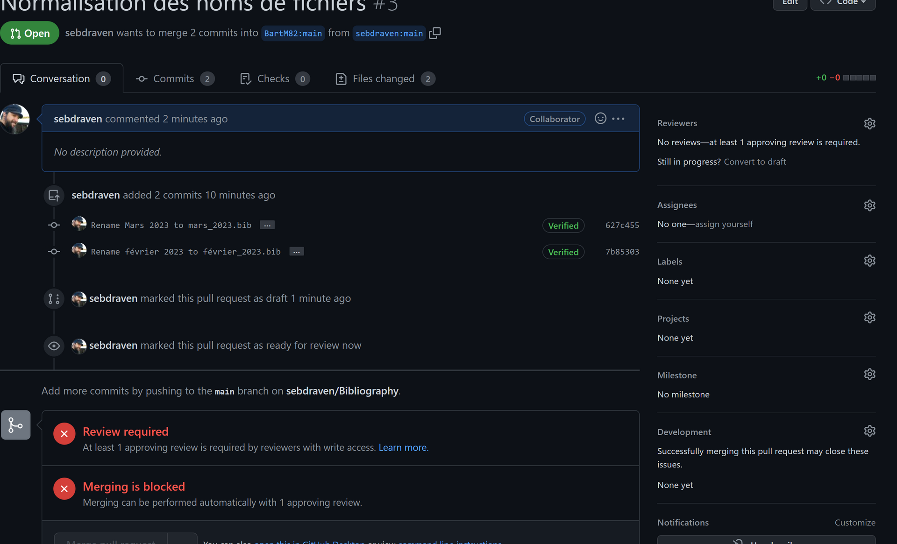

As a review has to be done, you have to wait for a reviewer to approve the commits.

Once approved, you receive a message and the status changes:

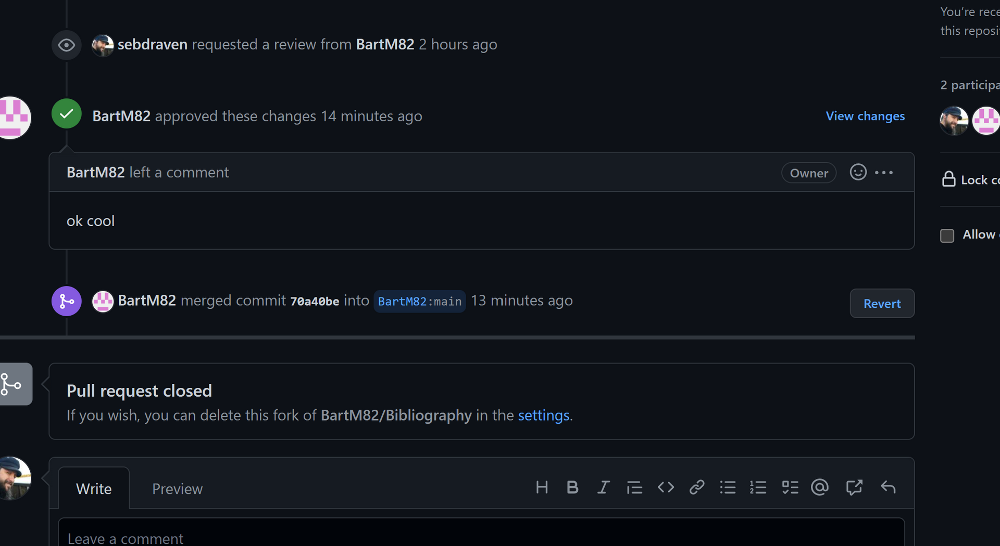
